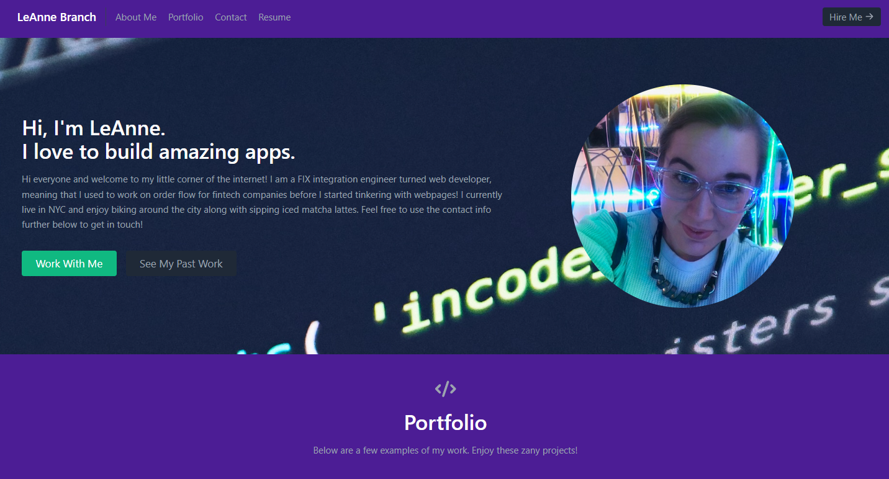

# LMB Portfolio Page - Built Using React!

## Description

The goal of this project was to create a personal portfolio page using React. I have included an About Me section along with a Contact form and small showcase of a few fun projects. Enjoy the site!

Site link: https://64bef8f2d7bb300008d61d68--strong-cassata-a70103.netlify.app/

## Installation

If cloning the project and running locally, please 'npm i' to install all of the dependencies within the package.json file. Then run 'npm start' and the app should be avaliable via http://localhost:3000/.

If you would like to just visit the app on the web, use the Netlify link! 
https://64bef8f2d7bb300008d61d68--strong-cassata-a70103.netlify.app/ 

## Usage

Screenshot below of the page in action!

## Credits

Columbia Coding Bootcamp

HUGE thank you to this tutorial by freecodecamp that was used to help create this app!
https://www.freecodecamp.org/news/build-portfolio-website-react/

Also, I would like to give a shout-out to these docs for having clear styling tips that were used to make the page:
https://flowbite.com/docs/typography/images/

https://tailwindcss.com/docs/border-style

## License

MIT License

## How to Contribute

Follow the [Contributor Covenant](https://www.contributor-covenant.org/)!
